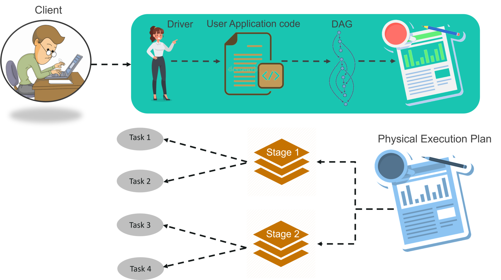

# PySpark-One-Stop-Tutorial
PySpark is a Python API for Apache Spark. Apache Spark is an analytical processing engine designed for large-scale, high-performance distributed data processing and machine learning applications. 

PySpark is widely used in the Data Science and Machine Learning communities, as there are many popular data science libraries written in Python, such as NumPy and TensorFlow.
It is also used because of its efficiency in processing large datasets.
Many organisations, including Walmart, Trivago, Sanofi, Runtastic, and others, have used PySpark. 

## Architecture
Workflow of Spark Architecture,

**STEP 1**
The client submits spark user application code. When an application code is submitted, the driver implicitly converts user code that contains transformations and actions into a logically directed acyclic graph called DAG. At this stage, it also performs optimizations such as pipelining transformations.

**STEP 2**
After that, it converts the logical graph called DAG into physical execution plan with many stages. After converting into a physical execution plan, it creates physical execution units called tasks under each stage. Then the tasks are bundled and sent to the cluster.

**STEP 3**
Now the driver talks to the cluster manager and negotiates the resources. Cluster manager launches executors in worker nodes on behalf of the driver. At this point, the driver will send the tasks to the executors based on data placement. When executors start, they register themselves with drivers. So, the driver will have a complete view of executors that are executing the task.

**STEP 4**
During the course of execution of tasks, driver program will monitor the set of executors that runs. Driver node also schedules future tasks based on data placement. 

## PySpark Features
- In-memory computation
- Distributed processing using parallelize
- Can be used with many cluster managers (Spark, Yarn, Mesos e.t.c)
- Fault-tolerant
- Immutable
- Lazy evaluation
- Cache & persistence
- Inbuild-optimization when using DataFrames
- Supports ANSI SQL

## Advantages of PySpark
- PySpark is a general-purpose, in-memory, distributed processing engine that allows you to process data efficiently in a distributed fashion.
- Applications running on PySpark are 100x faster than traditional systems.
- You will get great benefits using PySpark for data ingestion pipelines.
- Using PySpark we can process data from Hadoop HDFS, AWS S3, and many file systems.
- PySpark also is used to process real-time data using Streaming and Kafka.
- Using PySpark streaming you can also stream files from the file system and also stream from the socket.
- PySpark natively has machine learning and graph libraries.

## Installation Guide
For installing PySpark, Follow the guidelines present on the official PySpark page,

- [PySpark Installation Guide](https://spark.apache.org/docs/latest/api/python/getting_started/install.html)

*OR* 

You can use *Docker* to set up the environment using the following guide,

- [PySpark using Docker](https://towardsdatascience.com/stuck-trying-to-get-pyspark-to-work-in-your-data-science-environment-here-is-another-way-fb80a4bb7d8f)

## Dataset Used
The Dataset used for this tutorial can be found at [here](https://www.kaggle.com/datasets/dinnymathew/usstockprices).

# References and Resources

- [PySpark Documentation](https://spark.apache.org/docs/latest/api/python/getting_started/quickstart_df.html)
- [Spark by Example](https://sparkbyexamples.com/pyspark/pyspark-partitionby-example/)
- [Spark Core Concepts](https://luminousmen.com/post/spark-core-concepts-explained)
- [PySpark by Databricks](https://databricks.com/glossary/pyspark)
- [PySpark Cheat Sheet by AWS](https://s3.amazonaws.com/assets.datacamp.com/blog_assets/PySpark_SQL_Cheat_Sheet_Python.pdf)
